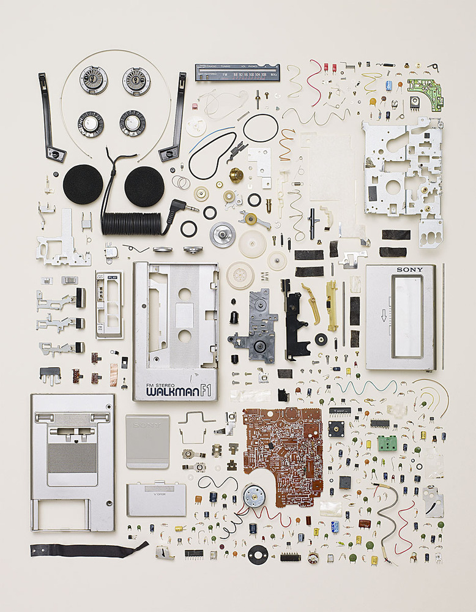

For your final project, you will select a specific digital device and trace the lifecycle of its manufacture, use, re-use, and disposal.  This is a very big task.  A single smartphone, for instance, contains over two hundred chemical compounds, and the scale of its production is truly global: from rare-earth metal mines in Baotou, to data centers in Iowa, to grey markets in Jakarta, and electronics scrap yards in Delhi.  So, there are many different methods for going about this, many different pieces of the puzzle you can choose to focus on, and no two final projects will look alike. 

The project consists of two components.  First, you will produce some form of **conceptual model of your artifact,** using a map, icons, matrices, or 3D modeling.  Examples include any or a combination of the following:

- Create a supply chain map for your artifact using [Sourcemap](http://www.sourcemap.com/).
- Express the composition of your artifact using a symbol system like Otto Neurath's [Isotype](http://www.gerdarntz.org/isotype) from the 1920s, a font called the Pictorial Communication Language ([PICOL](http://picol.org/picol_icon_font)), [font awesome icons](http://fontawesome.io/icons/), or a [design structure matrix](https://mitpress.mit.edu/books/design-structure-matrix-methods-and-applications).
- Photogrammetry using the [123D Catch](http://www.123dapp.com/catch) app, which allows you to upload photos from your smartphone to the cloud, where they're transformed into a textured 3D model.

In addition to the above, you will write a **paper of 5-7 pages** that situates your artifact within the contexts discussed in class.  I expect you to draw from the readings we considered, as well as secondary research from sources we did not cover.  The following resources will help get you started:

### videos & games

- [The Story of Electronics](http://storyofstuff.org/movies/story-of-electronics/) (brief documentary)
- [Phone Story](http://www.phonestory.org/) — “follow your phone’s journey around the world and fight the market forces in a spiral of planned obsolescence”
- [ToxiCity: life at Agbobloshie, the world's largest e-waste dump in Ghana](https://www.youtube.com/watch?v=mleQVO1Vd1I) (brief documentary)

### academic sites

- [Discard Studies: Social Studies of Waste, Pollution, and Externalities](https://discardstudies.com/)
- [Supply Studies](https://supplystudies.com/) -- writing about logistics, supply chains, and global assemblies of assembly"

### industry & activism

- [Good Electronics](https://goodelectronics.org/) — international network on human rights and sustainability in electronics
- [Tantalum Investing News](http://investingnews.com/category/daily/resource-investing/critical-metals-investing/tantalum-investing/)

### books

- David S. Abraham, [*The Elements of Power: Gadgets, Guns, and the Struggle for a Sustainable Future in the Rare Metal Age*](http://yalebooks.com/book/9780300196795/elements-power) (Yale University Press, 2015)
- Todd McLellan, [*Things Come Apart: A Teardown Manual for Modern Living*](http://www.toddmclellan.com/thingscomeapar) [photobook] (Thames & Hudson, 2013)

I ask that you submit a brief proposal of your project to me the week of our April 18th class.  The final project is due May 8.  You will also present on your artifact during the final two class sessions for around 5 minutes.