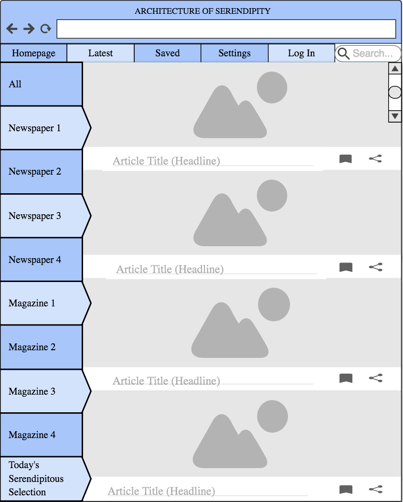

One of the aims of this course is to explore the relationship between theory and practice. To this end, you will construct a "re-design" of an existing media system for your midterm, due March 9.  These interventions can range from micro-level (e.g. proposing a particular tweak to the infrastructure of the Internet and tracing its consequences) to whole-cloth (e.g. envisioning an alternate peer-to-peer messaging system). You will situate this re-design amongst our readings up to this point, using the texts to help imagine the implications of your re-design.

The final form of this assignment should be a paper of 5 to 7 pages, properly referenced, and with additional media as necessary or desired.  Virtually any medium could work: paper prototypes, clay, painting, video, etc. You will additionally give an informal presentation of your re-design to the class.

For inspiration, see:

- Anthony Dunne and Fiona Raby, [*Speculative Everything: Design, Fiction, and Social Dreaming*](https://mitpress.mit.edu/books/speculative-everything), (Cambridge: MIT Press, 2013).
- "Forecasts" published by [*The Long + Short*](http://thelongandshort.org/forecasts) magazine

# Student Projects

**Theodora Davis**

> This paper explores a re-envisioned Tinder – a Tinder that moves away from performativity and towards quality relationship-creating decisions. The paper outlines Tinder as an application and discusses the issues it presents. In response, two proposals are imagined: first, what if instead of uploading pictures of themselves, the user uploaded a hologram of their everyday life? And secondly, what if instead of uploading pictures of themselves, the user uploaded a notes page of quotes they have spoken from their everyday lives? The implications of these revisions are then considered. Would these redesigns be beneficial? Outdated? We are invited to explore a new set of technical and ethical questions that comes with a redesign.

**Timothy Goodwin, "Authorless Twitter: Finding Social Understanding by Undoing Our Networked Identities"**

> As a response to the fake news phenomenon and its relationship to identity needs on social media, my project imagines a redesigned Twitter platform which omits both the concept of the user profile as well as the networked environments of social media. These two design are implemented explore the functions of authorship and identity on social media and their effects on the way information propagates through networked spaces. The entire platform operates through nothing more than the physical proximities of its users to emphasize a participatory relationship between user and content, as opposed to the consumptive relationship found in current social media platforms. The platform’s combination of anonymity, connectedness, and participation seeks to create a new media logic that can be used to pursue a better understanding of societal realities within a post-truth media environment.

**Miles Hilton, "Bringing Digital Privacy Out of 1986**

> National American digital privacy law has not been updated since 1986, when text messaging, email attachments, and smartphones did not exist. What would law enforcement, communication, and product development look like if laws governing digital privacy caught up with the devices and data they govern?

**Graham Johnson, "Gene Editing: Speculation as to Its Cultural Ramifications and Resulting Interfaces"**

> Using contemporary precedents like body piercings, tattoo art, and the fashion industry, this paper speculates on how the first two generations of gene-based body modification might play out.

**Jillian Knoll, "Title: And Now Some Propaganda From Our Sponsors"**

> At a time in the not too distant future, amidst societal outcry following a successful attempt by hackers, posing as advertisers, to successfully identify web users based on personal information provided to allow targeted advertising, the government decided to make one last legal attempt to codify a set of privacy principles for all web users. Users were made identifiable by matching publicly available descriptive information with the private information cookies unknowingly left behind, a breadcrumb trail across all the parts of the web that the users visited. Rather than attempting to prevent illicit collection of private data, legislators banned all forms of behaviorally targeted advertising leading to a rise in natively sponsored content which would permanently transform the new and digital media systems that populate today’s landscape, resulting in a climate of decreased social capital and a cynical attitude towards unreliable media creators. How do average end users know what content is paid for and what is unbiased? In looking at this potential evolution of today’s broken advertisement-dependent media ecosystem we also explore how to prevent this future, by creating and enforcing a system of informed consent for the interest-based advertising that funds our most of our favorite web 2.0 destinations.

**Daniella Levitan, "The Notification"**

**George Liu, "Design Accuracy and the News: A Systematic Redesign of the 21st Century News Homepage"**

> This paper contributes a new schema of accuracy to the current discussion about accuracy and the news. We come up with a model of design accuracy, examine various design accuracy problems with contemporary news homepages, and offer a potential solution in the form of a functional prototype.

**Sophie Lucy, "A Virtual Workspace"**

> What if the future of the workplace is in the home? Can meetings in virtual reality replace emails and video conferences?

**Melisa Ozen, "Architecture of Serendipty"**

**Matthew Piccolella, "Making Files More Physical"**

> "Making Files More Physical" redesigns the way that files are stored and exchanged. At the highest level, we hope to make files more physical; that is, we will redesign the way that files work to more closely emulate the ways that specifically books, movies, and music worked before they were ported to digital. Our analysis is broken down into four main parts. Our first section outlines the problem: what is it we lost when we transitioned from physical objects to files, and what new problems have been created. Next, we’ll discuss the theory that relates to the topic, specifically Steven Jackson's "ethics of care" and Bruce Sterling's conception of the Internet of Things. Next, we propose an implementation that would involve deteriorating files and a mechanism through which a file can be loaned and borrowed as physical objects are. Finally, we’ll discuss in some detail the implications of this proposed implementation.

**Tara Pichumani, "Media and Policy: Optimizing New Media for Socio-Political Benefits"**

**Alyssa Rodia, "Reimagining New York City's Subway Map Technology"**

> Massimo Vignelli’s redesign of the MTA’s subway map in the 20th century was a groundbreaking, and was quite frankly the only innovation made to subway mapping technology and design that directly affected the user experience. In our modern world of connectedness, technology in the palm of our hands, and constant need for interactivity and knowledge, it is quite surprising that New York City has not followed through to create a new mapping system that catered directly to the needs of the consumer. With the growing historical significance of Google and Google Maps in changing the way the world imagines direction forever, it is important to understand and imagine a new technology design in which mass transit riders can interact with the subway system in a positive and innovative manner. Upon exploring where we have been, where we are, and where we are going in the realm of technology and cartography, I seek to theorize a new app design in which users can create for themselves a revolutionary and newly imagined experience of mass transit to change the way in which they interact with urban space in the age of technology today and for years to come.

**Cecília Simas, "The Ideal Messenger"**

> A messaging application built using blockchain technology could solve many of our current issues with data privacy and security. Doing away with the reliance on an underlying currency present in current blockchain implementations, the app would be able to explore the advantages of the technology, such as decentralization and encryption, to provide a superior product for its users. The main challenge in achieving this is a dependency on users to maintain the service.